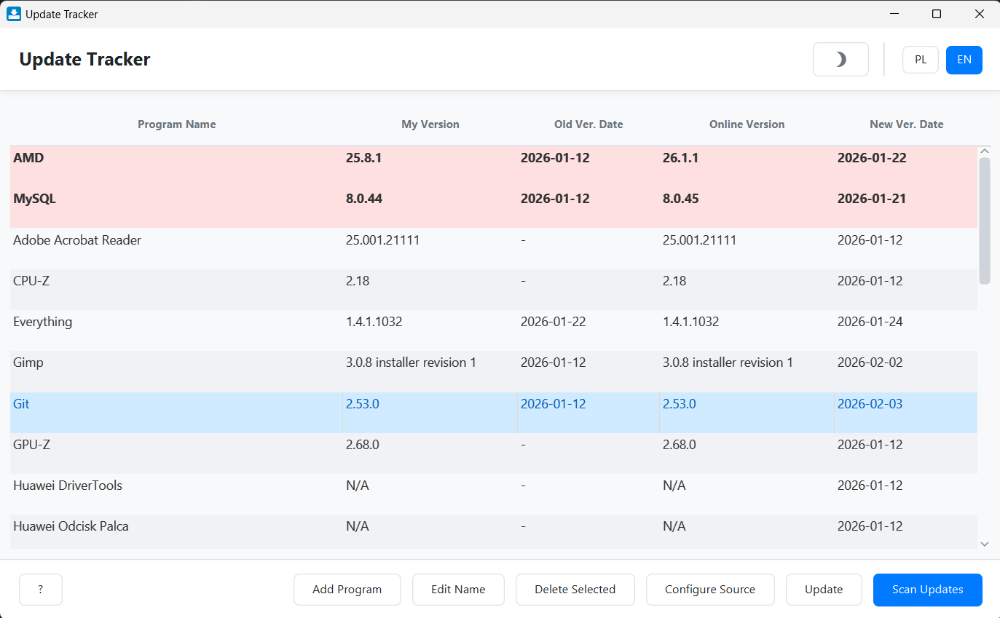
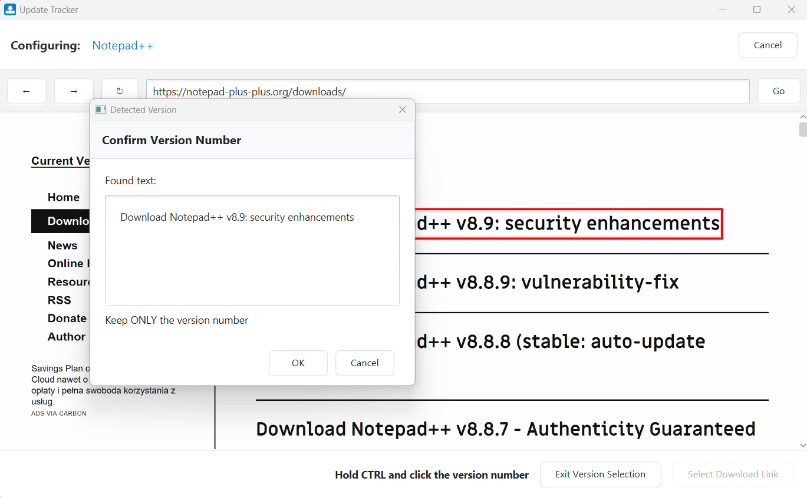
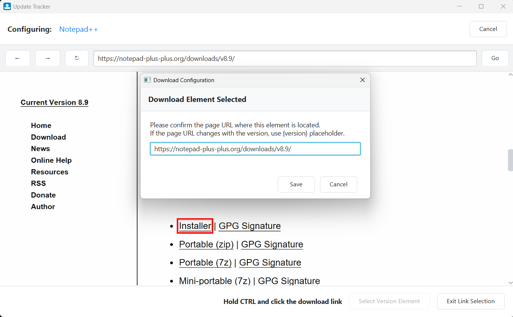
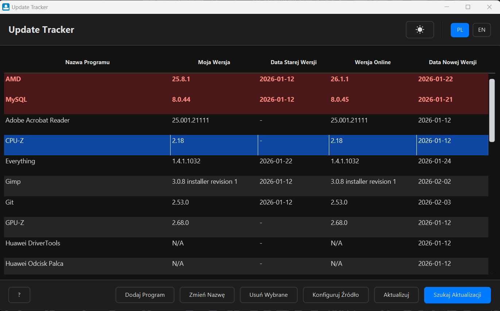

# Update Tracker


<br>
Update Tracker is a modern JavaFX desktop application designed to help you keep track of software updates, game versions, or any other text-based information on the web. It allows you to monitor changes on specific web pages and notifies you when a new version is detected.

## ✨ Features

- **Smart Scraping:** Supports both static websites (via Jsoup) and dynamic, JavaScript-heavy pages (via embedded WebView).
- **Visual Selector:** Point-and-click interface to select exactly which element on the page contains the version number.
- **Intelligent Regex:** Automatically generates and self-heals regular expressions to extract version numbers cleanly.
- **Direct Downloads:** Configure download links to grab the latest installers directly from the app.
- **Customization:**
    - Dark and Light themes.
    - Multi-language support (English & Polish).
- **Local Storage:** All data is saved locally in JSON format (no cloud account required).

## 📸 Screenshots

<details>
  <summary>See Home Page</summary>
  <br>
  
  <br>
</details>
<details>
  <summary>See Version Number Selection</summary>
  <br>
  
  <br>
</details>
<details>
  <summary>See Download Link Selection</summary>
  <br>
  
  <br>
</details>
<details>
  <summary>See Dark Mode</summary>
  <br>
  
  <br>
</details>

## 🛠️ Tech Stack

- **Language:** Java 21+
- **GUI Framework:** JavaFX
- **Build Tool:** Gradle
- **Libraries:**
    - [Jsoup](https://jsoup.org/) - HTML parsing
    - [Jackson](https://github.com/FasterXML/jackson) - JSON serialization
    - [Ikonli](https://kordamp.org/ikonli/) - Icon packs

## 🚀 Getting Started

### Prerequisites

- [Java Development Kit (JDK) 21](https://adoptium.net/) or higher.

### Installation

1. **Clone the repository:**
   ```bash
   git clone [https://github.com/konradcz2001/update-tracker.git](https://github.com/konradcz2001/update-tracker.git)
   cd update-tracker
   ```

2. **Build and Run (Windows):**
   ```powershell
   ./gradlew run
   ```

3. **Build and Run (Linux/macOS):**
   ```bash
   ./gradlew run
   ```

## 📖 Usage Guide

1. **Add a Program:** Click the "Add" button and enter a name for the software you want to track.
2. **Configure Source:**
    - The app will open the editor view.
    - Enter the URL of the webpage you want to monitor.
    - Click **"Select Version Element"**.
    - Hover over the version number on the webpage (it will highlight in red) and **Ctrl + Click** to select it.
    - Confirm the extracted text.
3. **Scan for Updates:** On the dashboard, click "Scan Updates" to check all tracked programs.
4. **Update Program:** Click the **"Update"** button to open the action menu:
    - **Download File:** Automatically downloads the installer if a download link is configured.
    - **Manual Update:** Manually marks the program as updated to the latest version.
    - **Remove Source:** Clears the download configuration.

## 🤝 Contributing

Contributions are welcome! Please feel free to submit a Pull Request.

1. Fork the project
2. Create your Feature Branch (`git checkout -b feature/AmazingFeature`)
3. Commit your changes (`git commit -m 'Add some AmazingFeature'`)
4. Push to the Branch (`git push origin feature/AmazingFeature`)
5. Open a Pull Request

## 📄 License

This project is licensed under the MIT License - see the [LICENSE](LICENSE) file for details.
